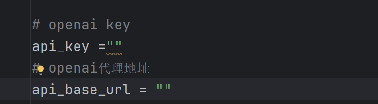
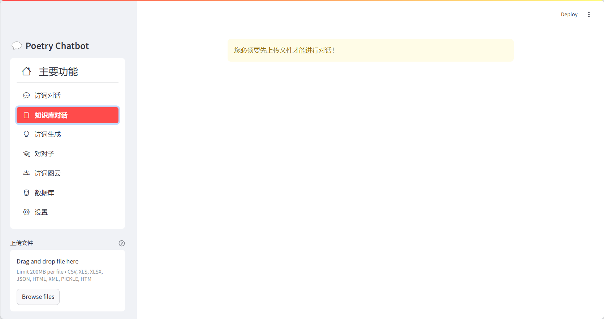
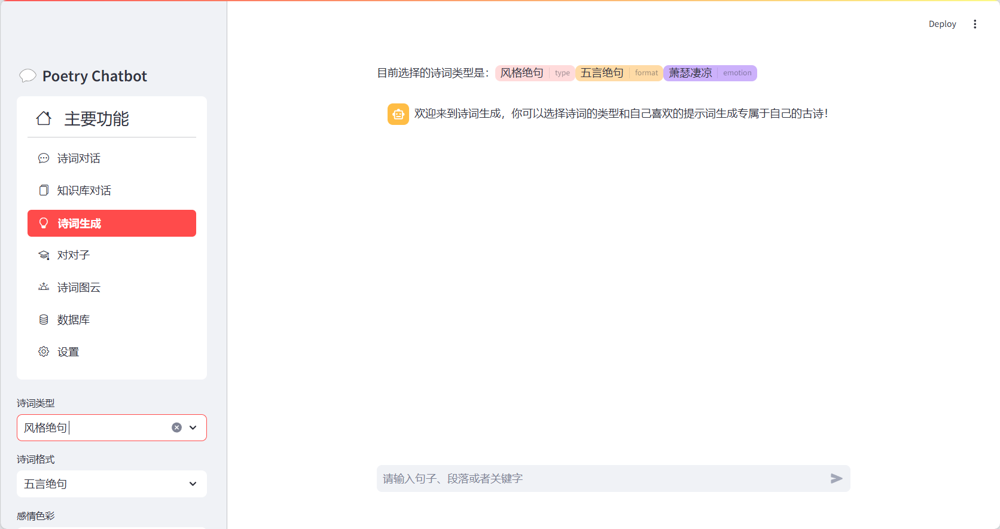

# Dialogue-with-poetry - 智能诗词对话

### 项目简介

Dialogue-with-poetry是一款融合了大语言模型和中国传统诗词文化的智能对话系统。通过与AI的交互，用户能够深入了解诗词的魅力，激发创作灵感，享受沉浸式诗词学习体验。系统支持诗词对话、本地知识库对话、诗词创作及对联游戏等功能。

### 使用技术

- **LLamaIndex**: 高效的信息检索框架，用于诗词对话和知识问答。
- **Python**: 主要开发语言，负责业务逻辑的实现。
- **SQLite**: 轻量级数据库，用于存储诗词数据。
- **FastAPI**: 构建高性能API服务器，支持异步请求处理。
- **Streamlit**: 快速搭建美观的用户界面，提升用户体验。

### 安装步骤

1.确保已安装**Python 3.10**或以上版本。

2.克隆项目仓库到本地：

```bash
git clone https://github.com/RisingIce/Dialogue-with-poetry.git
cd Dialogue-with-poetry
```

3.创建虚拟环境并激活（两种方式选一种即可）：

```bash
#1.py
#创建环境
python -m venv .venv
#激活环境
source .venv/bin/activate # Linux/MacOS
.venv\Scripts\activate # Windows

#2.conda
#创建环境
conda create -n envname python=3.10
#激活环境
conda actiavte envname
```

4.安装项目依赖：

```bash
pip install -r requirements.txt
```

5.进入app/database/config文件下修改Openai的key以及代理地址（如果有）



如果要使用自己部署的大模型，推荐使用**Ollma**

链接：(https://github.com/ollama/ollama)

详细部署方法查看ollama官方教程，这里不过多展开

### 启动命令

1.启动后端API服务器：

```
uvicorn app.main:app --host 127.0.0.1 --port 9880
```

2.启动前端应用程序（Streamlit）：

```
streamlit run webui/webui_dialogue
```

浏览器访问 `http://localhost:8501` 即可开始使用Dialogue-with-poetry智能诗词对话。

前端网页示例图片：

1.诗词对话界面


2.知识库对话界面



3.诗词生成界面



### 致谢

非常感谢以下的开源项目，排名不分先后

1.[🧶最全中华古诗词数据库](https://github.com/chinese-poetry/chinese-poetry)

2.[LLamaIndex是一个用于您的LLM应用程序的数据框架](https://github.com/run-llama/llama_index)

3.[FastAPI 框架](https://github.com/tiangolo/fastapi)

4.[streamlit](https://github.com/streamlit/streamlit)


